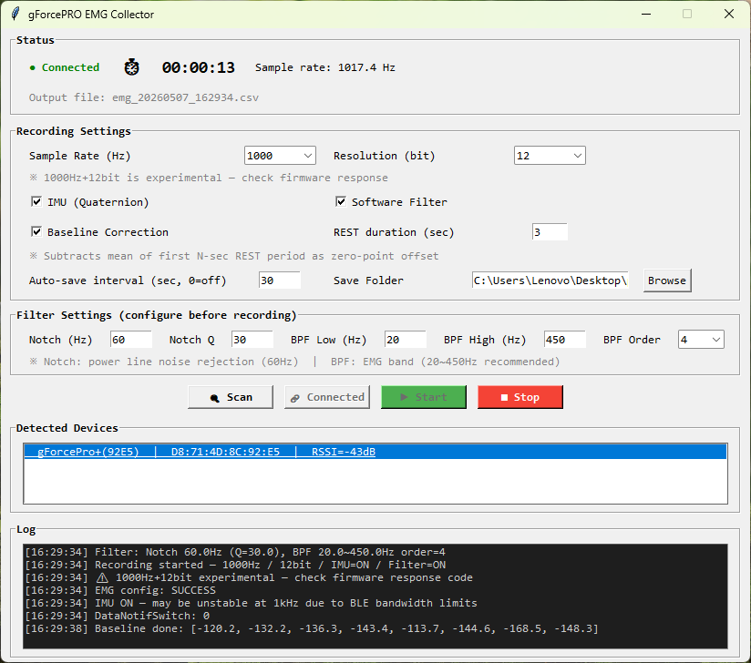
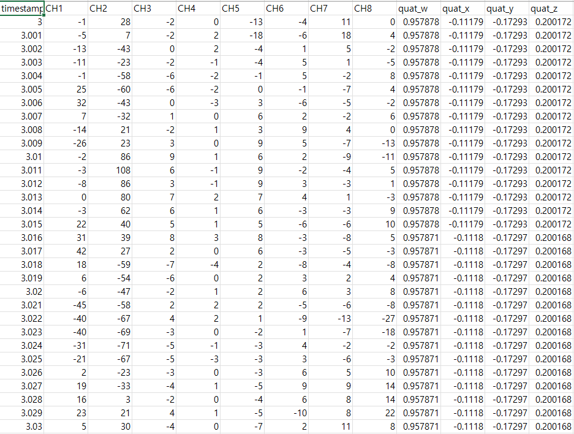

# gForcePRO EMG Collector

A real-time EMG data acquisition tool for the **OYMotion gForcePRO** armband. Built on the official Python SDK with bug fixes, extended features, and an intuitive GUI.

Developed as part of a robotic hand EMG signal processing research project at **KITECH (Korea Institute of Industrial Technology)**.

---

## Screenshots

**Baseline collection in progress**


**Recording at 1000Hz / 12-bit after baseline**



**Collected CSV data**



---

## Why This Tool?

The official `oym8CHWave` app records raw `.bin` files with no timestamps, no IMU data, and no way to configure filters or verify sampling rate. This tool replaces it with a full GUI that gives you:

- Accurate **per-sample timestamps** (always ≥ 0, strictly increasing)
- **12-bit resolution at 1000Hz** : the official app only supports 8-bit at 1kHz
- **Real-time software filters** (Notch + Bandpass), fully configurable
- **Baseline correction** (automatic zero-point offset per channel)
- **IMU (Quaternion)** simultaneous acquisition
- **Reliable BLE connection** : fixed SDK bugs that caused slow and unstable pairing on PC
- **Auto-save** by user-defined time interval (seconds)

---

## Features

### ✅ 12-bit Resolution at 1000Hz
The official firmware spec states 12-bit is limited to 500Hz due to BLE bandwidth constraints. This tool sends the 12-bit + 1000Hz configuration command directly via SDK and **confirms it with the firmware response code** (`RSP_CODE_SUCCESS`). The result: 12-bit data at 1000Hz, verified working.

### ✅ Baseline Correction (Zero-Point Offset)
The ADC zero-point varies per channel and per session, and resting EMG is not naturally centered at 0. This tool optionally collects a user-defined REST period at recording start, computes the per-channel mean, and subtracts it from all subsequent samples. Signals are then centered around 0 during rest.

```
[16:29:38] Baseline done: [-120.2, -132.2, -136.3, -143.4, -113.7, -144.6, -168.5, -148.3]
```

### ✅ Configurable Software Filters
Applied on the PC side, the SDK delivers raw ADC values with no built-in filtering:

| Filter | Type | Default | Purpose |
|---|---|---|---|
| Notch | IIR (iirnotch) | 60Hz, Q=30 | Power line noise rejection |
| Bandpass | Butterworth | 20~450Hz, 4th order | EMG frequency band |

All parameters are adjustable in the GUI: Notch frequency, Q factor, BPF low/high cutoff, and filter order.

### ✅ Reliable BLE Connection
The original SDK had three bugs that caused slow and unreliable BLE pairing on PC, while the same device connected instantly on mobile:

| Bug | Original | Fixed |
|---|---|---|
| Event loop blocked during scan | `time.sleep(timeout)` | `await asyncio.sleep(timeout)` |
| MTU print format error | `"mtu:{1}".format(...)` | `"mtu:{0}".format(...)` |
| Disconnect state not updated | `self.state == ...` (comparison) | `self.state = ...` (assignment) |

The first bug was the primary cause. `time.sleep()` blocked the asyncio event loop during BLE scanning, causing timeouts and connection failures.

### ✅ Accurate Timestamps
The original packet-interpolation approach produced negative timestamps and non-monotonic sequences at packet boundaries. This tool uses a **cumulative sample counter**:

```
timestamp = sample_index × (1 / sample_rate)
```

Timestamps are guaranteed to be always ≥ 0 and strictly increasing, regardless of BLE jitter.

### ✅ Auto-Save by Time Interval
Splits output CSV into new files at a user-specified interval (seconds). For example, set to 30 to get clean 30-second segments — useful for long sessions or labeled gesture recording.

### ✅ IMU (Quaternion) Simultaneous Acquisition
Receives quaternion orientation data alongside EMG. Each CSV row stores the most recently received quaternion packet, forward-filled between IMU updates.

---

## Packet Structure

```
Packet = [header: 1 byte] + [EMG data: 128 bytes]

  8-bit mode:  128B = 8 channels × 16 samples per packet
  12-bit mode: 128B = 8 channels × 8 samples per packet (2 bytes per channel, LSB 12-bit)
```

At 1000Hz, approximately 62 packets are received per second in 8-bit mode.

---

## Output Format

```csv
timestamp_s,CH1,CH2,CH3,CH4,CH5,CH6,CH7,CH8,quat_w,quat_x,quat_y,quat_z
3.000,-1,28,-2,0,-13,-4,11,0,0.957878,-0.11179,-0.17293,0.200172
3.001,-5,7,-2,2,-18,-6,18,4,0.957878,-0.11179,-0.17293,0.200172
3.002,-13,-43,0,2,-4,1,5,-2,0.957878,-0.11179,-0.17293,0.200172
```

- `timestamp_s` : seconds from recording start (always ≥ 0, strictly increasing)
- `CH1~CH8` : EMG values (8-bit raw: 0~255 / 12-bit with baseline: centered around 0)
- `quat_*` : most recent quaternion (empty if IMU disabled)

---

## Installation

```bash
pip install bleak scipy numpy pillow
```

Python 3.8+. Tested on Windows 11 and macOS. Note: on macOS, observed sample rate may be slightly lower (~900 Hz) due to differences in the BLE stack compared to Windows.

---

## Usage

```bash
python collect_emg_en.py
```

1. Click **Scan** : discovers nearby gForcePRO devices (5 sec)
2. Select device → **Connect**
3. Configure sample rate, resolution, filters, auto-save interval
4. *(Optional)* Enable **Baseline Correction** and set REST duration (e.g. 3 sec)
5. Click **Start** → keep arm relaxed during the baseline REST period if enabled
6. Click **Stop** → CSV saved automatically

---

## Files

```
collect_emg.py    — Main application (GUI)
gforce.py         — gForcePRO BLE SDK wrapper (bug-fixed from original)
bin_to_csv.py     — Offline converter: .bin files from official app → .csv
```

### Offline Bin Converter

For `.bin` files recorded with the official `oym8CHWave` app:

```bash
python bin_to_csv.py data.bin            # default: 8ch, uint8
python bin_to_csv.py data.bin 8 uint8    # explicit
python bin_to_csv.py data.bin 8 int16    # for 12-bit raw
```

---


## References

- [OYMotion gForcePRO](https://oymotion.github.io/en/gForce/gForcePro/gForcePro/)
- [gForce SDK Manual](https://oymotion.github.io/en/gForce/SDK/gForceSDK/)
- [gForceSDKPython (original)](https://github.com/oymotion/gForceSDKPython)
